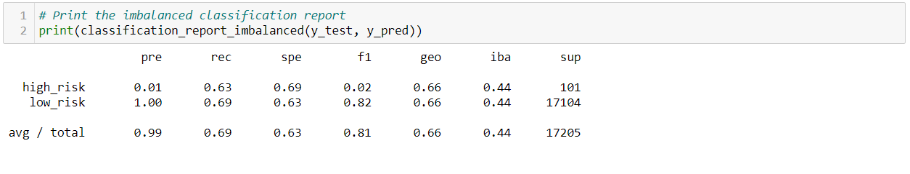

# Credit_Risk_Analysis

Machine learning model to solve: credit card risk, unbalanced classification problem.

## Objective

 Employ different techniques (algorithms) to train and evaluate models with unbalanced classes. Using `imbalanced-learn` and `scikit-learn` libraries to build and evaluate models using `resampling`.

## Results over six machine learning models

### Oversampling

- `Naive Random Oversampling`: for this model, accuracy is relatively low with 0.587, and precision ("pre" column) and recall ("rec" column) are high for the majority class, precision is very low for the minority class being unable to detect high-risk loans.

- `SMOTE Oversampling`: with this model while accuracy increases, the precision and recall, are still not optimal to detect the minority class (high-risk loans).

### Undersampling

- `Random Under Sampler`: even with this model undersampling with only 246 observations, the accuracy and the precision and recall do not improve in the minority class failing still on detecting high-risk loans.

### Combination (Over and Under) Sampling

- `SMOTEENN`: while the accuracy score with this model increases (0.6447) against the previous models, precision ("pre" column) is still not optimal to detect the minority class, but in the recall ("rec" column) its observed a higher result for the higher-risk loans, still it's not an optimal model to make a business decision.

### Ensemble Learners

- `Balanced Random Forest Classifier`: as it has seen before and taking for this model the F1 score (weighted average of the true positive rater-recall) and precision, where the best score is 1.0 and the worst is 0.0. This model is still not accurate for the minority class.

Also, this model allows to sort the features by importance, whats makes it see that there are many of them are irrelevant for the model, so a reduction of variables and focusing only on those that are more relevant could result in a better model.

- `Easy Ensemble AdaBoost Classifier`: for the last model even with the improvements, it's still a weak model to detect high-risk loans, so there is a big space to work in another alternative.

## Summary

Working on a model with an imbalanced data set like the case analyzed creates challenges such as: while resampling can attempt to address the imbalance, it does not guarantee better results like was seen in the different models.

There is space to explore alternative models such as using Deep Learning techniques such as neural networks and evaluate its results.
